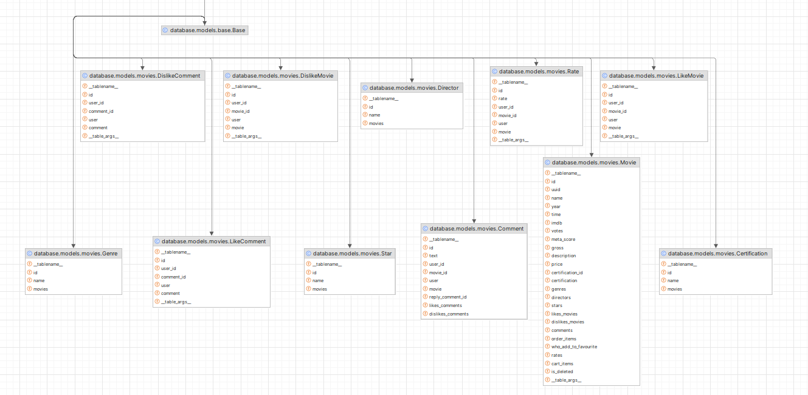
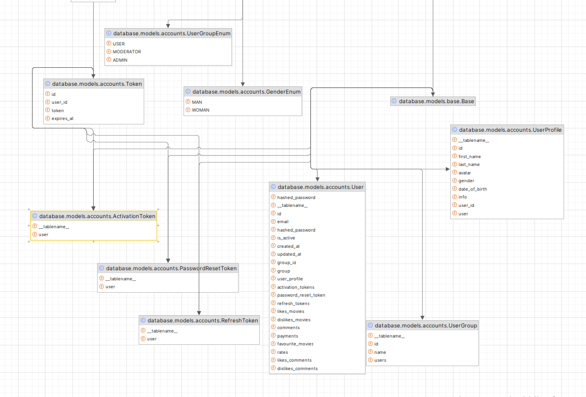
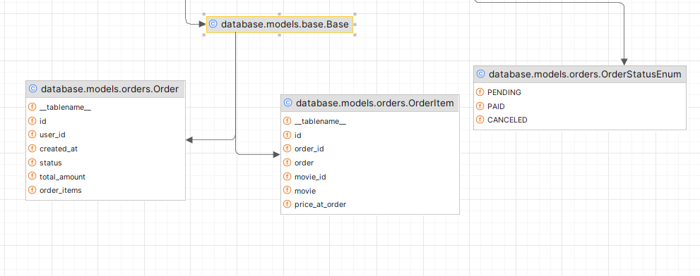
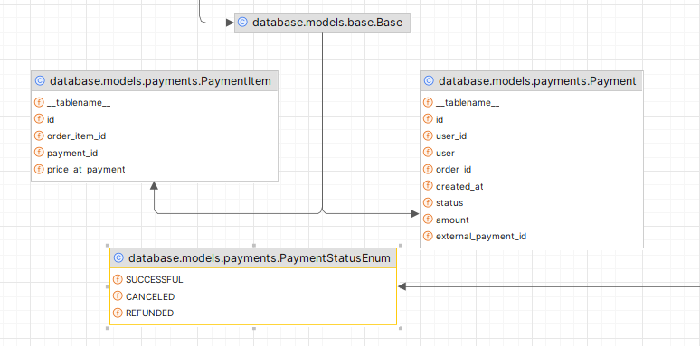
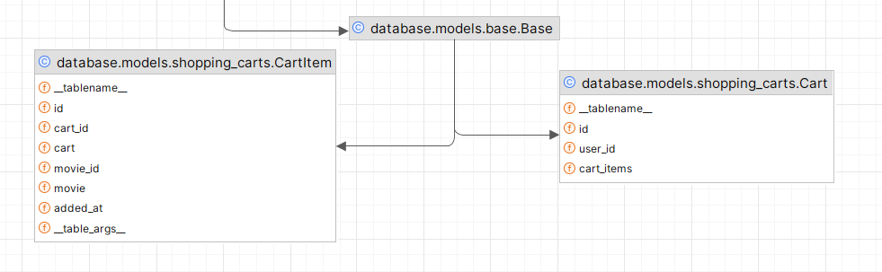

# py-online-cinema

This application provides a system of managing online-cinema. Consistent CRUD movies, genres, actors, orders, shopping_carts, payments, accounts.






### Installation

2. Clone the repo
   ```sh
   git clone https://github.com/sashasyrota/py-online-cinema.git
   ```

3. Run project in docker
    ```sh
   docker-compose up --build
   ```

4. Create bucket for avatars in minio:
http://127.0.0.1:9001/browser/avatars
5. 

After running and creating bucket, you can test app in browser:
http://127.0.0.1:8000

Application documentation:
http://127.0.0.1:8000/docs

## Features
General:
* JWT authenticated
* Documentation
* Docker
* Pydantic
* Celery/Celery Beat
* Stripe

Accounts:
* Cleaning invalid refresh_token by celery
* Adding avatar to profile
* Admin can manually activate account and change user group

Movies:
* Managing movie
* Like/dislike movie
* Creation comments to movie
* Like/dislike comments
* Reply Comments
* Filtering movie by params
* Rates movie

Shopping carts:
* Managing cart
* Validation adding purchased movie to cart

Order:
* Creation order by shopping cart 
* Cancel order

Payments:
* Create payments by Stripe
* Create refund payment

## Contact

sasha.syrota15@gmail.com
Project Link: https://github.com/sashasyrota/py-online-cinema/tree/develop